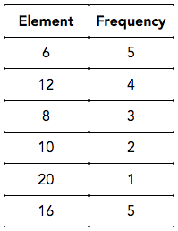

### Calculating mean:


```c++

std::vector<int> v = {10, 40, 30, 50, 20};

mean<int> m;

std::cout << m.get_mean(v);

```


### Calculating weighted mean:


```c++

std::vector<float> vec = {1,2,3,4};

std::vector<float> weights = {1,2,3,4};

weighted_mean<float> wm;

float value = wm.get_weighted_mean(vec, weights);

```


### Calculating the median


```c++

std::vector<int> v = {10, 40, 30, 50, 20};

median<int> m;

std::cout << m.get_median(v);

```


### Calculating the mode


```c++

std::vector<int> v = {10, 40, 30, 50, 20};

mode<int> m;

std::cout << m.get_mode(v);

```


### Calculating the standard deviation


```c++

std::vector<double> v = {10, 40, 30, 50, 20};

standard_deviation<double> m;

std::cout << m.get_standard_deviation(v);

```


### Calculating the interquartile range


```c++

std::vector<float> v = { 6, 6 ,6, 6, 6.1, 8, 8, 8, 10, 10, 12, 12, 12, 12, 16, 16, 16, 16, 16, 20};

interquartile_range<float> m;

std::cout << m.get_interquartile_range(v);

```


Sometimes, your input for interquartile range shall have map with frequencies like this,

(Image source: HackerRank)




You can convert this map to a vector using *frequency_converter* class.


**Example:**


```c++

std::map<float, unsigned long int> feq_map; // your frequency map

std::vector<float> v;  // The target vector where the result will be saved

frequency_map_converter<float> c;

c.to_vector(feq_map, v);

```


### Calculating the range:


```c++

std::vector<float> v = { 6, 6 ,6, 6, 6, 8, 8, 8, 10, 10, 12, 12, 12, 12, 16, 16, 16, 16, 16, 20};

range<float> m;

std::cout << m.get_range(v);

```


### Calculating the quartile:


```c++

std::vector<float> v = {7, 15, 36, 37.5, 39, 40, 41};

quartile<float> m;

std::map<std::string, float> result = m.get_quartile(v);

std::cout << "q1:\t" << result["q1"] << "\tq2:\t"<< result["q2"] << "\tq3:\t" << result["q3"];

```

# PROBABILITY

Let us say that our sample space S = {1, 2, 3, 4, 5} and we have two events E1 and E2 where E1= {1,2} and E2= {1,2,3}.

#### E1 U E2 = {1,2,3}

```c++
#include "statx.h"

int main()
{
	std::set<std::vector<int>> sample;
	for (int i = 1; i < 6; i++)
	{
		sample.insert({ i });
	}
	sample_space<int> s(sample);

	std::set<std::vector<int>> e1_container;
	e1_container.insert({ 1 });
	e1_container.insert({ 2 });

	std::set<std::vector<int>> e2_container;
	e2_container.insert({ 1 });
	e2_container.insert({ 2 });
	e2_container.insert({ 3 });
	
	std::set<std::vector<int>> output;
	event_union(e1_container, e2_container, s, output);

	for (auto i : output) for (auto j : i) std::cout << j << " ";
	int i;
	std::cin >> i;
}
```


## Text Processing:

### Encoding the categorical data

```c++

// SWAMI KARUPPASWAMI THUNNAI

#include "statx.h"

int main()
{
	LabelEncoder<std::string> encoder;
	std::vector<std::string> array = { "z", "a", "b", "c" };
	encoder.fit(array);
	std::vector<long int> new_array = encoder.transform();
	std::vector<long int>::iterator itr1 = new_array.begin();
	std::vector<long int>::iterator itr2 = new_array.end();
	for (std::vector<long int>::iterator itr = itr1; itr != itr2; ++itr)
	{
		std::cout << *itr <<" ";
	}
	int i;
	std::cin >> i;
}

// Output: 3 0 1 2
```
